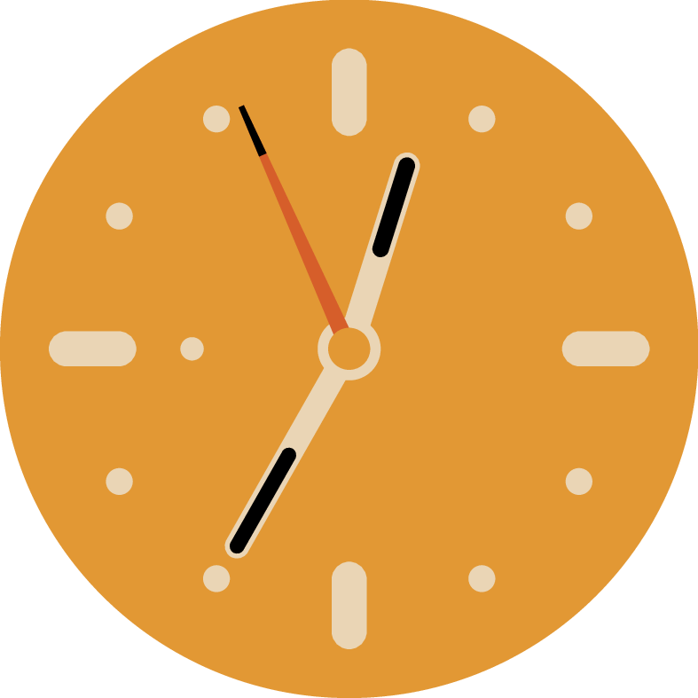

# Punkt Uhr

<p aling="center">

</p>

I make a clock in a piece of art work from [Anna Kövecses](https://anna-kovecses.com/) move!
Well, sort of.
It's a [piece art work](https://anna-kovecses.com/Punkt) for a Swiss company
that depicts a sunny-side-up egg with its yolk being a clock.
I wrote a simple script that re-generates the art work with any specified time.

To generate a picture, use
```bash
./generate HH-MM-SS
```
where `HH` is the hour, `MM` is the minute, and `SS` is the second.
The generated picture is put in directory `output`.

## Set as Desktop (MacOS)

A bash script `set-desktop` is included to set the picture as background for MacOS.
Simply run
```bash
./set-desktop
```
and the background would be set to a clock with the current time.
And similar to `generate`, you can also specify a specific time:
```bash
./set-desktop HH-MM-SS
```

## Dependencies

The implementation is a simple `bash` script that depends on the following programmes:

- [`latex`](https://www.latex-project.org/) and [`latexmk`](https://ctan.org/pkg/latexmk/?lang=en): usually comes with [`TeXLive`](https://www.tug.org/texlive/).
- [`imagemagick`](https://imagemagick.org/index.php): install with your package manager.
- [`ghostscript`](https://www.ghostscript.com/): most likely pre-installed as `gs` command, or install with your package manager.
